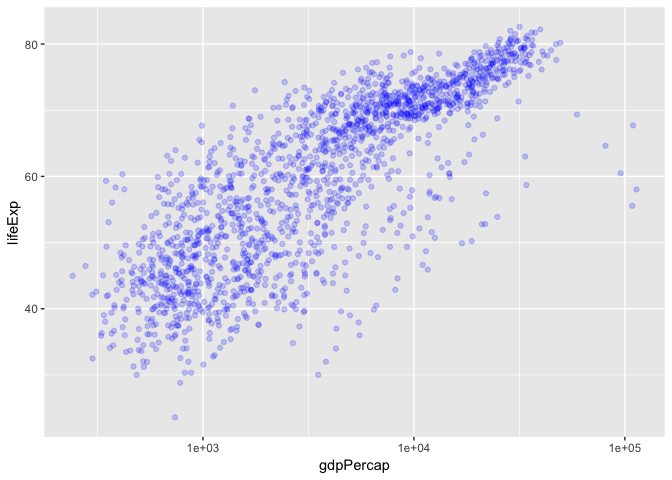
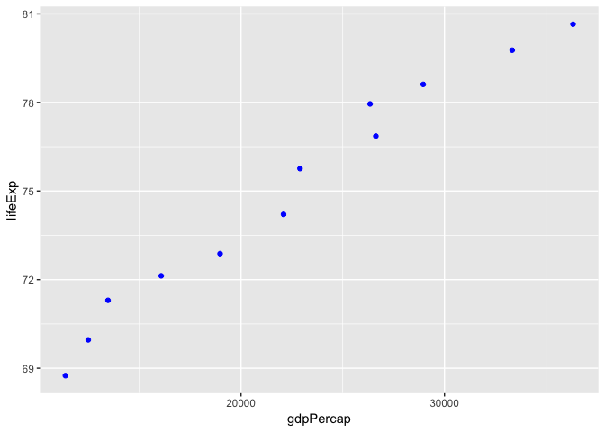
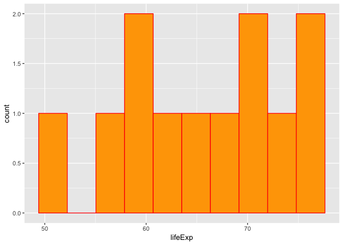
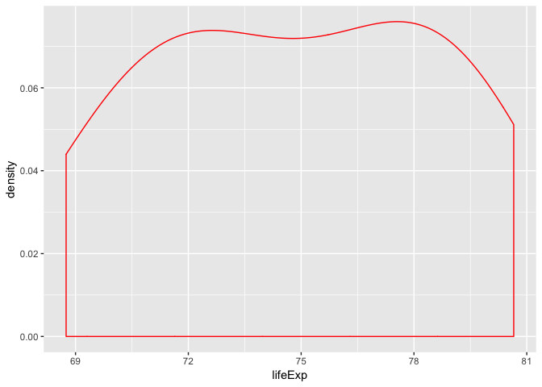
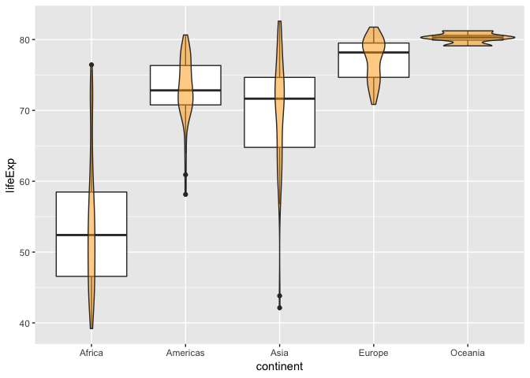
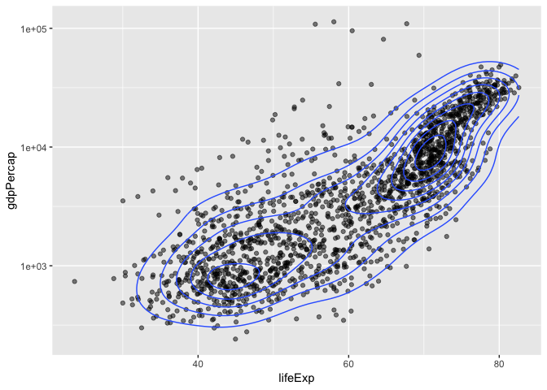

hw02-singhg53
================
Gurjot Singh
20/09/2018

# Homework Assignment \#2

By: Gurjot Singh (singhg53)

Hello\! Today we will be exploring a the dataset known as `gapminder`.

## Smell test the data

For those who have not yet downloaded the dataset you can do so by
installing the package by the function:

`install.packages("gapminder")`

Now since you have downloaded the dataset lets load it using the
`library` function:

``` r
library(gapminder)
```

Let’s also install and load the tidyverse
    package:

`install.packages("tidyverse")`

``` r
library(tidyverse)
```

    ## ── Attaching packages ────────────────────────────────────────────────────────────────── tidyverse 1.2.1 ──

    ## ✔ ggplot2 3.0.0     ✔ purrr   0.2.5
    ## ✔ tibble  1.4.2     ✔ dplyr   0.7.6
    ## ✔ tidyr   0.8.1     ✔ stringr 1.3.1
    ## ✔ readr   1.1.1     ✔ forcats 0.3.0

    ## ── Conflicts ───────────────────────────────────────────────────────────────────── tidyverse_conflicts() ──
    ## ✖ dplyr::filter() masks stats::filter()
    ## ✖ dplyr::lag()    masks stats::lag()

The cool thing about the tidyverse package is that includes different
functions that could be used like `ggplot2` and `dplyr`

**Question: Is `gapminder` a data frame, a matrix, a vector, a list?**

First let’s check what type of dataset is `gapminder` using the `typeof`
function:

``` r
typeof(gapminder)
```

    ## [1] "list"

`gapminder` is found to be a list.

This shows us that the dataset is a list. But it is important to test if
a dataset is a dataframe because a dataframe are lists as well.

``` r
is.data.frame(gapminder)
```

    ## [1] TRUE

Since this is true we can establish that the dataset is indeed a data
frame.

A cool way to check if the dataset is a martix or an array is using the
functions below.

``` r
is.matrix(gapminder)
```

    ## [1] FALSE

``` r
is.array(gapminder)
```

    ## [1] FALSE

Both of them come out false, as expected.

**Question: What is its class?**

The class of the dataset can be found by using the `class` function

``` r
class(gapminder)
```

    ## [1] "tbl_df"     "tbl"        "data.frame"

This is another way we could find that `gapminder` is a data frame.

**Question: How many variables/columns?**

The number of columns can be found using the `ncol` function:

``` r
ncol(gapminder)
```

    ## [1] 6

This shows us that there are six columns in the dataset.

**Question: How many rows/observations?**

Let’s check how many rows are in the data set using the `nrow` function:

``` r
nrow(gapminder)
```

    ## [1] 1704

We can conclude there are 1704 rows in this dataset.

**Question: Can you get these facts about “extent” or “size” in more
than one way? Can you imagine different functions being useful in
different contexts?**

We can use the `dim` function to tell us the size or the exent of the
data

``` r
dim(gapminder)
```

    ## [1] 1704    6

The `dim` function could give us the number of rows and columns using
one function, where the number of rows come first and the number of
columns comes second.

**Question: What data type is each variable?**

The structure of the dataset can also tell us about the extent or size
of the data and it could tell us what data type is each
    variable

``` r
str(gapminder)
```

    ## Classes 'tbl_df', 'tbl' and 'data.frame':    1704 obs. of  6 variables:
    ##  $ country  : Factor w/ 142 levels "Afghanistan",..: 1 1 1 1 1 1 1 1 1 1 ...
    ##  $ continent: Factor w/ 5 levels "Africa","Americas",..: 3 3 3 3 3 3 3 3 3 3 ...
    ##  $ year     : int  1952 1957 1962 1967 1972 1977 1982 1987 1992 1997 ...
    ##  $ lifeExp  : num  28.8 30.3 32 34 36.1 ...
    ##  $ pop      : int  8425333 9240934 10267083 11537966 13079460 14880372 12881816 13867957 16317921 22227415 ...
    ##  $ gdpPercap: num  779 821 853 836 740 ...

The data type of each variable has been summarized in the table below:

| **Variable** | **Data Type** |
| ------------ | ------------- |
| country      | Factor        |
| continent    | Factor        |
| year         | Integer       |
| lifeExp      | Number        |
| pop          | Integer       |
| gdpPercap    | Number        |

# Explore Individual Variables

Question: Pick **at least** one categorical variable and at least one
quantitative variable to explore.

  - What are possible values (or range, whichever is appropriate) of
    each variable?
  - What values are typical? What’s the spread? What’s the distribution?
    Etc., tailored to the variable at hand.
  - Feel free to use summary stats, tables, figures. We’re NOT expecting
    high production value (yet).

Let’s first explore the continent variable, which is categorical:

``` r
summary(gapminder$continent)
```

    ##   Africa Americas     Asia   Europe  Oceania 
    ##      624      300      396      360       24

Using the `summary` function we could see that the continent dataset has
five possible variables: Africa, Americas, Asia, Europe, and Oceania. In
addition, the `summary` function it tells us information about the
values of each variable. Africa has 624 observations (rows of
information) versus the Americas which have 300 observations.

Now let’s look at a numerical variable such as lifeExp

``` r
summary(gapminder$lifeExp)
```

    ##    Min. 1st Qu.  Median    Mean 3rd Qu.    Max. 
    ##   23.60   48.20   60.71   59.47   70.85   82.60

Again, the `summary` function is very powerful because it can provide us
with a great deal of information. Using this function we have found the
spread of the data giving the maximum (82.60), the minimum (23.60), the
median (60.71), and the mean (59.47).

Let’s do another numerical variable for fun to go above and beyond, such
as, gdpPercap

``` r
summary(gapminder$gdpPercap)
```

    ##     Min.  1st Qu.   Median     Mean  3rd Qu.     Max. 
    ##    241.2   1202.1   3531.8   7215.3   9325.5 113523.1

Using this function we have found the spread of the data giving the
maximum (113523.1), the minimum (241.2), the median (3531.8), and the
mean (7215.3).

## Explore various plot types

Question: Make a few plots, probably of the same variable you chose to
characterize numerically. You can use the plot types we went over in
class (cm006) to get an idea of what you’d like to make. Try to explore
more than one plot type. Just as an example of what I mean:

  - A scatterplot of two quantitative variables.
  - A plot of one quantitative variable. Maybe a histogram or
    densityplot or frequency polygon.
  - A plot of one quantitative variable and one categorical. Maybe
    boxplots for several continents or countries.

You don’t have to use all the data in every plot\! It’s fine to filter
down to one country or small handful of countries.

Use `filter()`, `select()` and `%>%`

Use `filter()` to create data subsets that you want to plot.

Practice piping together `filter()` and `select()`. Possibly even piping
into `ggplot()`.

**Question: A scatterplot of two quantitative variables.**

First let’s make a scatterplot of two quantitative variables. I shall
use lifeExp and gdpPercap.

``` r
ggplot(gapminder, aes(gdpPercap, lifeExp)) +
  scale_x_log10() +
  geom_point(colour = "blue", alpha=0.2)
```

<!-- -->

I have changed the y-axis to make it a logarithmic scale for better
visualization and added some colour.

Let’s take this a step further and use the `pipe` function and the
`filter` function.

``` r
gapminder %>%
  filter(country == "Canada") %>%
  ggplot(aes(gdpPercap, lifeExp)) +
  geom_point(colour = "blue", fill = "blue")
```

<!-- -->

**Question: A plot of one quantitative variable. Maybe a histogram or
densityplot or frequency polygon.**

Let’s use a different country, for example, Mexico, and plot a histogram
of the lifeExp:

``` r
gapminder %>%
  filter(country == "Mexico") %>%
  ggplot(aes(lifeExp)) +
  geom_histogram(colour = "red", fill = "orange", bins = 10)
```

<!-- -->

Let’s go above and beyond and create a density plot for a different
country, such as, Canada and observing lifeExp.

``` r
gapminder %>%
  filter(country == "Canada") %>%
  ggplot(aes(lifeExp)) +
  geom_density(colour = "red")
```

<!-- -->

**A plot of one quantitative variable and one categorical. Maybe
boxplots for several continents or countries.**

In this plot we filtered out years greater than 2000 and plotted the
continent with the lifeExp using a violin boxplot. This type of boxplot
gives great information regarding the overall distribution of the data.

``` r
gapminder %>% 
  filter(year > 2000) %>% 
  ggplot(aes(continent, lifeExp)) +
  geom_boxplot() +
  geom_violin(width = 1, fill = "orange", alpha=0.5)
```

<!-- -->

**A little something extra**

Now let’s do something that hasn’t been done in class yet. We are going
to create a 2d density plot using variables of lifeExp and gdpPercap\!

``` r
ggplot(gapminder, aes(lifeExp, gdpPercap)) +
  geom_point(alpha = 0.5) + 
  geom_density_2d() + 
  scale_y_log10()
```

<!-- -->

From these exercises we have learned how to use the `pipe` function,
`filter` function, and many more\!

## Resources

[Here](http://genomicsclass.github.io/book/pages/dplyr_tutorial.html) is
a site I used to help create the plots. It is a great resource\!

## But I want to do more\!

*For people who want to take things further.*

Evaluate this code and describe the result. Presumably the analyst’s
intent was to get the data for Rwanda and Afghanistan. Did they succeed?
Why or why not? If not, what is the correct way to do this?

    filter(gapminder, country == c("Rwanda", "Afghanistan"))

The above would be the incorrect way of filtering out information for
the countries. Using the technique above you loose a great deal of
information, becuase the information is known to be “recycled”.

To circumvent this problem we could do the following operation:

``` r
filter(gapminder, country == "Rwanda" | country == "Afghanistan")
```

    ## # A tibble: 24 x 6
    ##    country     continent  year lifeExp      pop gdpPercap
    ##    <fct>       <fct>     <int>   <dbl>    <int>     <dbl>
    ##  1 Afghanistan Asia       1952    28.8  8425333      779.
    ##  2 Afghanistan Asia       1957    30.3  9240934      821.
    ##  3 Afghanistan Asia       1962    32.0 10267083      853.
    ##  4 Afghanistan Asia       1967    34.0 11537966      836.
    ##  5 Afghanistan Asia       1972    36.1 13079460      740.
    ##  6 Afghanistan Asia       1977    38.4 14880372      786.
    ##  7 Afghanistan Asia       1982    39.9 12881816      978.
    ##  8 Afghanistan Asia       1987    40.8 13867957      852.
    ##  9 Afghanistan Asia       1992    41.7 16317921      649.
    ## 10 Afghanistan Asia       1997    41.8 22227415      635.
    ## # ... with 14 more rows

Or we can do the following:

``` r
RandA = filter(gapminder, country %in% c("Rwanda", "Afghanistan"))

RandA %>% 
  knitr::kable()
```

| country     | continent | year | lifeExp |      pop | gdpPercap |
| :---------- | :-------- | ---: | ------: | -------: | --------: |
| Afghanistan | Asia      | 1952 |  28.801 |  8425333 |  779.4453 |
| Afghanistan | Asia      | 1957 |  30.332 |  9240934 |  820.8530 |
| Afghanistan | Asia      | 1962 |  31.997 | 10267083 |  853.1007 |
| Afghanistan | Asia      | 1967 |  34.020 | 11537966 |  836.1971 |
| Afghanistan | Asia      | 1972 |  36.088 | 13079460 |  739.9811 |
| Afghanistan | Asia      | 1977 |  38.438 | 14880372 |  786.1134 |
| Afghanistan | Asia      | 1982 |  39.854 | 12881816 |  978.0114 |
| Afghanistan | Asia      | 1987 |  40.822 | 13867957 |  852.3959 |
| Afghanistan | Asia      | 1992 |  41.674 | 16317921 |  649.3414 |
| Afghanistan | Asia      | 1997 |  41.763 | 22227415 |  635.3414 |
| Afghanistan | Asia      | 2002 |  42.129 | 25268405 |  726.7341 |
| Afghanistan | Asia      | 2007 |  43.828 | 31889923 |  974.5803 |
| Rwanda      | Africa    | 1952 |  40.000 |  2534927 |  493.3239 |
| Rwanda      | Africa    | 1957 |  41.500 |  2822082 |  540.2894 |
| Rwanda      | Africa    | 1962 |  43.000 |  3051242 |  597.4731 |
| Rwanda      | Africa    | 1967 |  44.100 |  3451079 |  510.9637 |
| Rwanda      | Africa    | 1972 |  44.600 |  3992121 |  590.5807 |
| Rwanda      | Africa    | 1977 |  45.000 |  4657072 |  670.0806 |
| Rwanda      | Africa    | 1982 |  46.218 |  5507565 |  881.5706 |
| Rwanda      | Africa    | 1987 |  44.020 |  6349365 |  847.9912 |
| Rwanda      | Africa    | 1992 |  23.599 |  7290203 |  737.0686 |
| Rwanda      | Africa    | 1997 |  36.087 |  7212583 |  589.9445 |
| Rwanda      | Africa    | 2002 |  43.413 |  7852401 |  785.6538 |
| Rwanda      | Africa    | 2007 |  46.242 |  8860588 |  863.0885 |

I hope you enjoyed going through my homework assignment\!
